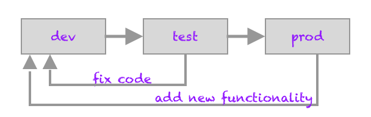
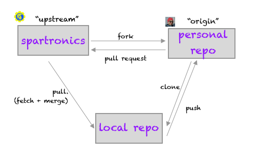

# Introducing Git and GitHub
<!-- TOC -->

- [Introducing Git and GitHub](#introducing-git-and-github)
- [What is Git and GitHub?](#what-is-git-and-github)
- [Common Terms](#common-terms)
    - [What is workflow? And, what does it have to do w/ git?](#what-is-workflow-and-what-does-it-have-to-do-w-git)
    - [Why command-line for git vs. GUI app?](#why-command-line-for-git-vs-gui-app)
    - [What is a repo and remotes?](#what-is-a-repo-and-remotes)
    - [What is cloning or forking, and upstream?](#what-is-cloning-or-forking-and-upstream)
    - [What is branching? Checkout what?!](#what-is-branching-checkout-what)
    - [What does it mean to pull and merge? And pull request?](#what-does-it-mean-to-pull-and-merge-and-pull-request)
    - [What is commit vs stash vs push?](#what-is-commit-vs-stash-vs-push)

<!-- /TOC -->

# What is Git and GitHub?
Git is a distributed version control system -- a simple content tracker. Git
allows any developer with full read/write access to the repository. Project
workflow and governance rules dictates who and how changes will be
contributed back to the main repo.

Git is a robust and a simple system that handles large or small projects
efficiently. It is a great way for teams to work together, its flexible model
allows workflows to match the way a team works. And, for an individual
developer it is a fantastic resource to track and manage ones work.

GitHub is a public hosting site. Git has a rich ecosystem of hosting solutions
(GitHub, GitLab, ...), visual tools for ease of use (SourceTree, Git Extensions,
...), and integrated into other tools such as vscode. For our purposes, we use
git command-line with terminal or git shell app.

# Common Terms
As with any language, git has its own terminology. Understanding these terms and meaning makes learning git easier.

## What is workflow? And, what does it have to do w/ git?
Workflow refers to a sequence of steps that are required to proceed from
initiation to completion. At its basics, development workflow involves the following three steps:

* _dev_: development work, write code
* _test_: verify that code works to its spec, fix as needed
* _prod_: deploy to production, in the case of FIRST it would be our robot

Git enables teams to establish workflow they need to get to production ready code. Steps would include, but not limited to:
* deploying pre-production code to staging for testing, git branching simplifies managing staging vs. production code;
* enforcing code reviews before merging code, pull requests ensure code is properly reviewed before merging;
* tagging specific versions in order to track changes, such as at competitions.

Git, though maybe confusing at first, gives full empowerment to individuals --
it is really difficult to break anything in git that cannot be fixed unless you
deleted code w/o checking things in. So, don't be afraid to experiment,
[_commit often, perfect later, publish once_](https://sethrobertson.github.io/GitBestPractices/).

## Why command-line for git vs. GUI app?
For our purposes, we use git command-line with terminal or git shell app. If you
learn the fundamentals from the command-line, you will have easier time to map
them back to a GUI app, however that is not the case in reverse. In addition,
command-line is clean and straight-forward, and as mentors we have first hand
experience where GUI apps can lead someone astray.

## What is a repo and remotes?
Repo, repository, is a copy of the project. Each developer has a local copy of a
repository. When changes are shared, developers publish a copy of the repository
to GitHub, code hosting system. This is referred to as the remote repo, which is
accessed by its URL.

## What is cloning or forking, and upstream?
Creating a copy of a repo is the process of cloning or forking. Forks are simply
a divergence from the source repo. Fork is a GitHub term.

Project governance and policies determines which repo is the most important
version. The relationships between the projects are not fixed in stone -- it is
like a web. Generally, the "official" version is referred to as the _upstream_
of the current repository.

## What is branching? Checkout what?!
A single repo can store different versions of the project. These versions are
tracked via branches -- tracking enables git to follow changes to a
file/project. You can think of branches as a set of pointers, where process of
checkout will switch the branches you are working on. Master branch is a naming
convention, where _master_ is a repos default branch.

## What does it mean to pull and merge? And pull request?
Pull process retrieves the updates from the remote repository to automatically
incorporate them into repo. Process first _fetches_ the new changes and _merges_
them into the tracked copy of the local branch.

Pull request (PR) submits the changes to the "upstream" project to be reviewed
prior to merging to the main project version. PR is a GitHub term.

## What is commit vs stash vs push?
Commit is the process of permanently storing changes to a repo. Stash will
temporarily shelve the changes, where at a later time you can return to its
work. Push publishes the committed changes to a remote repo.
