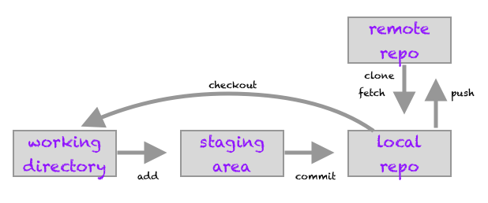
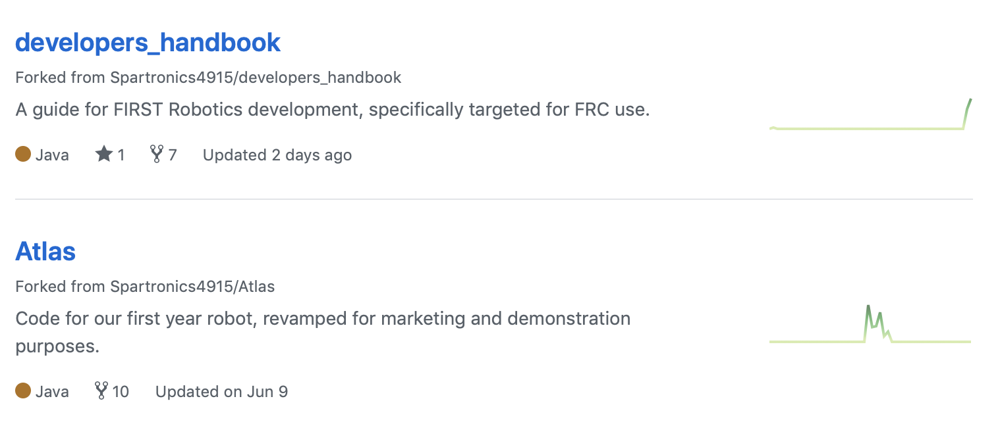
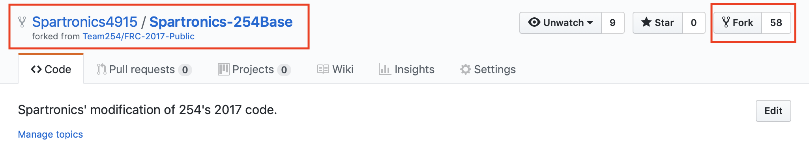

# Git Fundamentals
This section covers the basics of setting up git environment and most used commands.

* Install the latest version of git: https://www.git-scm.org
* If you don't have an account, sign up for a free GitHub account: https://www.github.com
* Use your package manager, or install GitHub's program here: https://desktop.github.com/

In the terminal, run the commands, without the dollar sign at the front -- quotes are important.

Important, git provides helpful information -- pay attention to the git outputs.

There are various git sources here is the link to [GitHub's bootcamp](https://help.github.com/categories/bootcamp/).

<!-- TOC -->

- [Git Fundamentals](#git-fundamentals)
- [Understanding git](#understanding-git)
- [Creating and contributing to a repo](#creating-and-contributing-to-a-repo)
    - [Git init](#git-init)
    - [Git clone](#git-clone)
    - [Git fork](#git-fork)
    - [GitHub pull request](#github-pull-request)
    - [Git commit messages](#git-commit-messages)
    - [Git log and git show](#git-log-and-git-show)
- [Basic git configuration](#basic-git-configuration)
    - [Username & email](#username--email)
    - [Git remotes](#git-remotes)
    - [.gitignore](#gitignore)
    - [Set default editor](#set-default-editor)
- [Git Commands](#git-commands)
    - [git init](#git-init)
    - [git status](#git-status)
    - [git add and git commit](#git-add-and-git-commit)

<!-- /TOC -->

# Understanding git
Git requires files to be added before they can be committed. This allow changes
to be committed in batches. Git uses _staging area_ to track changes which are
not yet committed. Git saves information about files' history in the .git directory.



# Creating and contributing to a repo
## Git init
If you are creating a new repo, setup your working directory first, and move to that directory before initializing the repo.

```sh
# create your working directory to host your project
$ cd
$ mkdir my_coolest_project
$ cd my_coolest_project

# initialize git repo
$ git init
Initialized empty Git repository in /Users/binnur/my_coolest_project/.git/
```

Initialing git repo, creates a .git directory to manage tracked files. Deleting this directory will delete all project history.
```sh
# show all files
$ ls -a
```
At this point, our project tracking is setup and ready to go. Remember previous comment about how helpful git is? Let's take a look at its status after _git init_. It tells us to use _git add_ to track files we want to add to version control.
```sh
# show the status of git
$ git status
On branch master

No commits yet

nothing to commit (create/copy files and use "git add" to track)
```

## Git clone
_git clone_ is the process of creating a copy of a target repository. With
GitHub you can simply copy the URL for the repo and execute a _git clone_
command on your system to create a copy.

GitHub provides HTTPS or SSH URLs for cloning. You can read more about it [here](https://help.github.com/articles/which-remote-url-should-i-use/)


```sh
# Clone to your destination, where you want to create the copy of the repo
$ git clone https://github.com/Spartronics4915/Atlas.git
Cloning into 'Atlas'...
remote: Enumerating objects: 1144, done.
remote: Total 1144 (delta 0), reused 0 (delta 0), pack-reused 1144
Receiving objects: 100% (1144/1144), 219.01 KiB | 2.28 MiB/s, done.
Resolving deltas: 100% (461/461), done.
```

## Git fork
_git fork_ is a copy of the repository that you manage in your own GitHub account. Here are example of forks in my GitHub account.


You can execute _fork_ from any of the repositories you wish to copy.


From there, you can _git clone_ to your system. Any changes you make to your
forked repo will not impact the source repo. If you want to collaborate with the
source repo, you use _pull request_ where the maintainers will review and merge
or reject/request updates to your contributions.

## GitHub pull request
You can contribute to a forked repository by submitting a _pull request_ to the
upstream repository.

[See GitHub documentation](https://help.github.com/articles/creating-a-pull-request-from-a-fork/).

## Git commit messages
_git commit_ messages are a great way to share the changes that has been made to the repo and why. Writing good commit messages important for good collaboration.

What is a bad commit message? Check out examples from [here](https://www.codelord.net/2015/03/16/bad-commit-messages-hall-of-shame/).

Commit structure is as follows. Read more about writing good commits [here](https://tbaggery.com/2008/04/19/a-note-about-git-commit-messages.html).
* 1st line is a summary, 50 chars or less
* 2nd line is a blank line
* 3rd+ lines are more detailed information about the change

## Git log and git show
_git log_ is a great way to explore contribution to a repo. Some handy git log options.

```sh
# basic git log
$ git log
# one line summary of commits
$ git log --oneline
# commit statistics
$ git log --stat
# commits by author
$ git shortlog
# pretty the output
$ git log --pretty="%cn committed %h on %cd"
# commits for an author
$ git log --author="Tarkan"
```

_git show_ displays specific information on a given commit. As input, you provide the sha slice.

```sh
$ git show 97a7c5f0d
$ git show 97a7c5f0d --stat
```

# Basic git configuration
## Username & email
Git users username and email to track changes and associate commits to the repo. You can set your username & email for global (across all repos) or for individual repos.

```bash
# set username & email for global git configuration
$ git config --global user.name "Your Name"
$ git config --global user.email "the email you used to sign up for github"
```

## Git remotes
For background on _git remotes_, see [What is a repo and remotes?](./git_about.md#"What-is-a-repo-and-remotes").

```sh
# specify your URL for the upstream
$ git remote add upstream https://github.com/Spartronics4915/2017-STEAMworks
# show remotes for my local developers_handbook repo
$ git remote -v
binnur	git@github.com:binnur/developers_handbook.git (fetch)
binnur	git@github.com:binnur/developers_handbook.git (push)
origin	git@github.com:Spartronics4915/developers_handbook.git (fetch)
origin	git@github.com:Spartronics4915/developers_handbook.git (push)
```

Using the remotes, I can pull the updates from _origin_, i.e. Spartronics' repo
for developers_handbook, to stay in sync with other developers on the repo.
Using _binnur_ I can push my updates to my GitHub repo and submit a pull request to Spartronics.

Note, your remotes can be named to anything. However, we will use the standard 'upstream' to refer to the source, and 'origin' to refer to our fork.

## .gitignore
_.gitignore_ specifies all files that should be untracked. See [GitHub's ignoring files for more information] (https://help.github.com/articles/ignoring-files/).

```sh
# ignore sketch files, anywhere in the git repo
$  cat .gitignore
*.sketch
```

## Set default editor
Many git commands will launch an editor for further input, such as applying commit changes. By default, git will use vi editor. However, you can configure your default editor.

```sh
# set nano as default editor
$ git config --global core.editor "nano -w"
```

# Git Commands
## git init
See [git init](./#Git-init) section for more information.

```sh
# initialize git repo
$ git init
Initialized empty Git repository in /Users/binnur/my_coolest_project/.git/
```

## git status
_git status_ is your friend! It is an overview of the status of the repo.

```sh
$ git status
On branch gitintro
Your branch is ahead of 'binnur/gitintro' by 1 commit.
  (use "git push" to publish your local commits)

Untracked files:
  (use "git add <file>..." to include in what will be committed)

	.gitignore
	git_intro/git_advanced.md
	git_intro/git_configure.md
	git_intro/git_faq.md
	git_intro/git_fundamentals.md
	git_intro/images/.DS_Store
	git_intro/images/clone.png
	git_intro/images/forking.png
	git_intro/images/forks.png
	git_intro/images/git_staging.png
	robot_lessons/.vscode/
	robot_lessons/.wpilib/
	robot_lessons/lesson1.code-workspace
	robot_lessons/lesson1/.settings/org.eclipse.jdt.core.prefs
	robot_lessons/lesson1/build/
	tutorials.code-workspace

nothing added to commit but untracked files present (use "git add" to track)
```
Looking at the git status, I can tell:
* I am on 'gitintro' branch
* My branch is ahead by 1 commit, meaning other developers following my fork on binnur/gitintro would not get my local updated
* I have several untracked files and I need to use _git add_ to track, i.e. add them to the repo

## git add and git commit
_git add_ and _git commit_ are used in combination to 'save' git repo's current state. _git add_ makes a change to the staging area by adding files from working directory to repo's staging area. Changes are not recorded until you _git commit_.

As discussed in the [git status](./#git-status) section, _git status_ highlights the status of the repo.

```sh
# start tracking the git_fundamentals.md file:w
$ git add git_intro/git_fundamentals.md
# add every file in the current directory
$ git add .
# add every file in the specified directory
$ git add <dir name>
```

_git commit_ will publish the git_intro/git_fundamentals.md file to the local repo
```sh
$ git commit
[gitintro c0bbf03] Initial content to 'git' going
 1 file changed, 325 insertions(+)
 create mode 100644 git_intro/git_fundamentals.md
 ```

### git reset

## git push

## git pull

## git fetch

## git merge